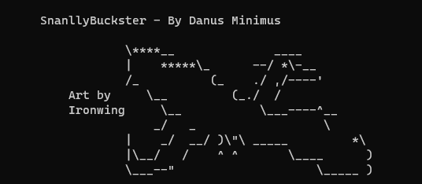

# SnallyBuckster – Finding interesting items in trashy buckets

## Prologue

Search interesting files within open S3 Buckets and Azure blobs instantly!
When using Grayhatwarfare I found myself struggling a lot in finding interesting files. How does one filter through more than 100k files in an open bucket to determine if the bucket contains any interesting data?
The idea for the creation of this tool was the fact that no tool like this existed on github. The only resemblance to a tool like SnallyBuckster was referenced in an article by [d34db33f](https://github.com/d34db33f-1007)- [called Chum Bucket.](https://hackmag.com/coding/chum-bucket/)
Utilizing [d34db33f](https://github.com/d34db33f-1007) Grayhatwarfare integration tool and [Hannos](https://twitter.com/hanno) tool [SnallyGaster](https://github.com/hannob/snallygaster) I was able to create SnallyBuckster!

## Usage

Simply run: main.py -apik <api_key> -bid <bucket_id> -pl <page_limit> and watch the results flow!

## Adding new entries to search

If you wish to add more interesting files into the search list, simply modify **search\_unique.py** master dictionary and include your own entries to it.

## Only works for premium+ users of GrayhatWarfare! Don't be cheap its just 20 bucks!
